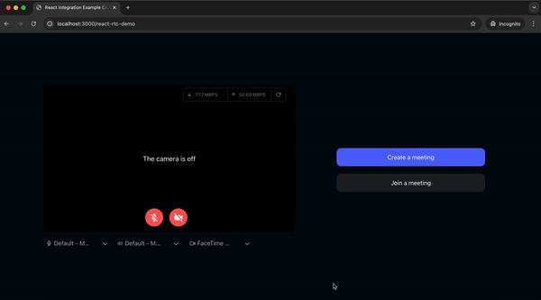

# AlignTalk - Video Conferencing App

AlignTalk is a video conferencing app built with React and powered by VideoSDK. It provides features like video calls, audio, and chat for seamless communication. This app is easy to set up and use for real-time virtual meetings.


</p>


## Running the Application

Follow these steps to get the sample app up and running:

### Step 1: Clone the Repository

```bash
git clone https://github.com/anuragkainth/alignTalk-video-conferencing.git
```

### Step 2: Set Up Environment Variables

Open your favorite code editor and copy the example environment file:

```bash
cp .env.example .env
```

### Step 3: Configure Your `.env` File

Generate a temporary token from your [**Video SDK Account**](https://app.videosdk.live/signup) and update the `.env` file:

```env
REACT_APP_VIDEOSDK_TOKEN="YOUR_TEMPORARY_TOKEN"
```

### Step 4: Install Dependencies

Install the necessary packages:

```bash
npm install
```

### Step 5: Launch the App

Bingo, it's time to push the launch button.

```bash
npm run dev
```

## Project Overview

### 1. Pre-Call Setup on Join Screen

- **[components/DropDown.js](https://github.com/videosdk-live/videosdk-rtc-react-sdk-example/blob/main/src/components/DropDown.js)** : A dropdown component for selecting audio input devices (microphones), monitoring audio via the Web Audio API, and managing microphone settings.

- **[components/DropDownCam.js](https://github.com/videosdk-live/videosdk-rtc-react-sdk-example/blob/main/src/components/DropDownCam.js)** : A dropdown component for selecting camera devices and managing camera permissions.

- **[components/DropDownSpeaker.js](https://github.com/videosdk-live/videosdk-rtc-react-sdk-example/blob/main/src/components/DropDownSpeaker.js)** : Allows users to select speakers, test them with sample sounds, and track playback progress for confirmation.

- **[components/NetworkStats.js](https://github.com/videosdk-live/videosdk-rtc-react-sdk-example/blob/main/src/components/NetworkStats.js)** : Displays real-time network statistics, such as upload and download speeds.


### 2. Create or Join Meeting

- **[`components/screens/JoiningScreen.js`](https://github.com/videosdk-live/videosdk-rtc-react-sdk-example/blob/main/src/components/screens/JoiningScreen.js)** : Provides users the option to create or join a meeting, manage webcam and mic status, select devices (microphone, camera, speakers), check permissions, preview video, and monitor network statistics to ensure proper setup before entering the meeting.

- **[`api.js`](https://github.com/videosdk-live/videosdk-rtc-react-sdk-example/blob/main/src/api.js)** : Includes all API calls for creating and validating meetings.

- **[`components/MeetingDetailsScreen.js`](https://github.com/videosdk-live/videosdk-rtc-react-sdk-example/blob/main/src/components/MeetingDetailsScreen.js)** : Displays options for creating or joining a meeting.

<p align="center">


### 3. Waiting Screen

- **[`components/screens/WaitingToJoin.js`](https://github.com/videosdk-live/videosdk-rtc-react-sdk-example/blob/main/src/components/screens/WaitingToJoinScreen.js)** : Displays a Lottie animation with messages while waiting to join the meeting. This screen is shown until the `isMeetingJoined` flag is true, which is received from the `meeting` initialized using `useMeeting()` from `@videosdk.live/react-sdk`.

### 4. Participant View

- **[`components/ParticipantView.js`](https://github.com/videosdk-live/videosdk-rtc-react-sdk-example/blob/main/src/components/ParticipantView.js)** : Displays a single participant's video with a corner display for the participant's name.

- **[`components/ParticipantGrid.js`](https://github.com/videosdk-live/videosdk-rtc-react-sdk-example/blob/main/src/components/ParticipantGrid.js)** : Displays a grid of participants shown on the main screen.

- **[`meeting/components/ParticipantView.js`](https://github.com/videosdk-live/videosdk-rtc-react-sdk-example/blob/main/src/meeting/components/ParticipantView.js)** : Manage how many participants will be displayed in the participant grid.


### 5. Meeting Bottom Bar

- **[`meeting/components/BottomBar.js`](https://github.com/videosdk-live/videosdk-rtc-react-sdk-example/blob/main/src/meeting/components/BottomBar.js)**  
  Contains the buttons displayed at the bottom of the screen:
  - Shows the meeting ID with a copy icon button on the left.
  - Displays the recording indicator, raise hand button, mic button (with a list of available mics), webcam button (with available webcam list), screen share button, and leave meeting button in the middle.
  - The rightmost corner contains the chat button and participant count button.
  - On a mobile, tablet, or smaller screens, the bottom bar reorders to show the leave button, recording button, mic/webcam buttons, and a `more actions` button. The `more actions` button opens a drawer containing the remaining options.


### 6. Presenter View

- **[`components/PresenterView.js`](https://github.com/videosdk-live/videosdk-rtc-react-sdk-example/blob/main/src/components/PresenterView.js)** : Displays the view when a participant shares their screen.

### 7. Chat

- **[`sidebar/ChatPanel.js`](https://github.com/videosdk-live/videosdk-rtc-react-sdk-example/blob/main/src/components/sidebar/ChatPanel.js)** : Contains the chat side panel, with a chat input field and a list of chat messages.

### 8. Participant List

- **[`sidebar/ParticipantPanel.js`](https://github.com/videosdk-live/videosdk-rtc-react-sdk-example/blob/main/src/components/sidebar/ParticipantPanel.js)** : Displays the list of participants present in the meeting.

### 9. Leave Screen

- **[`components/screens/LeaveScreen.js`](https://github.com/videosdk-live/videosdk-rtc-react-sdk-example/blob/main/src/components/screens/LeaveScreen.js)** : Displays the leave screen when participant exit the meeting.

<br/>